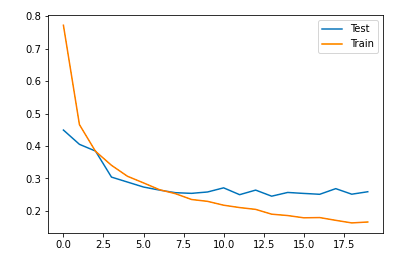
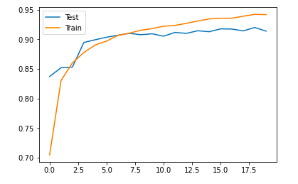

# Fashion-MNIST
Deep learning Model for predicting different fashion items like shoes, T-shirt etc from the image.

<h3>Dataset</h3>
ashion-MNIST is a dataset of Zalando's article images—consisting of a training set of 60,000 examples and a test set of 10,000 examples. Each example is a 28x28 grayscale image, associated with a label from 10 classes. Zalando intends Fashion-MNIST to serve as a direct drop-in replacement for the original MNIST dataset for benchmarking machine learning algorithms. It shares the same image size and structure of training and testing splits. 
Each image is 28 pixels in height and 28 pixels in width, for a total of 784 pixels in total. Each pixel has a single pixel-value associated with it, indicating the lightness or darkness of that pixel, with higher numbers meaning darker. This pixel-value is an integer between 0 and 255. The training and test data sets have 785 columns. The first column consists of the class labels (see above), and represents the article of clothing. The rest of the columns contain the pixel-values of the associated image. 

<ul><b>Labels</b>
<li>0 T-shirt/top</li>
<li>1 Trouser</li>
<li>2 Pullover</li>
<li>3 Dress</li>
<li>4 Coat</li>
<li>5 Sandal</li>
<li>6 Shirt</li>
<li>7 Sneaker</li>
<li>8 Bag</li>
<li>9 Ankle boot</li>

</ul>

 

<b>Dataset Link:-</b>https://www.kaggle.com/zalando-research/fashionmnist 
or you can directly import from Keras.datasets library

<h3>Model's Performance</h3>
<h5>Loss</h5>

<h5>Accuracy</h5>

